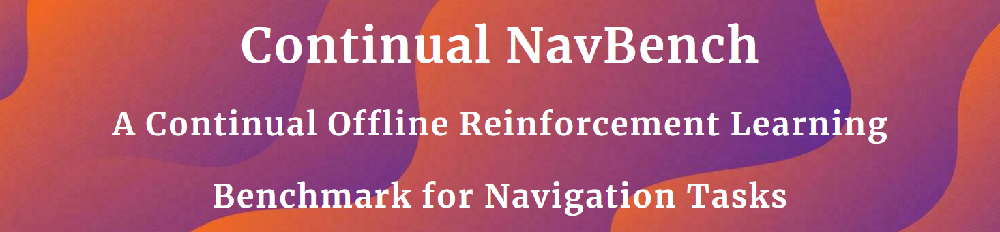
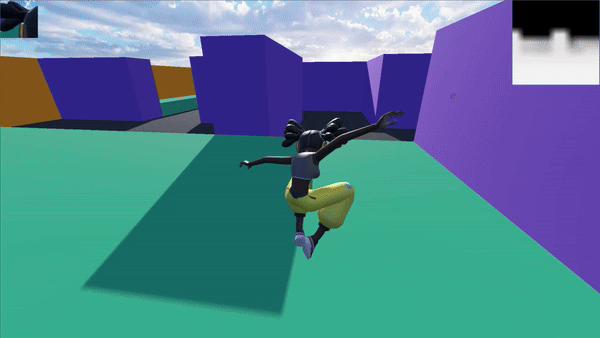

    

        

            <h2>
                <a href="https://toto.com" style="color:rgba(250, 174, 34, 0.88);">Paper</a>
                &emsp;
                &emsp;
                &emsp;
                <a href="https://sites.google.com/view/continual-nav-bench/home?authuser=2" style="color:rgba(250, 174, 34, 0.88);">Project Page</a>
                &emsp;
                &emsp;
                &emsp;
                <a href="https://drive.google.com/drive/folders/1QHzGofKymDIkoN1_4FlPwLlJ0pFwilUo?usp=sharing" style="color:rgba(250, 174, 34, 0.88);">Datasets</a>
            </h2>
        

  

## Overview

Continual NavBench is an open-source benchmark for evaluating Offline Continual Reinforcement Learning (CRL) in video game–inspired navigation tasks. It provides Godot-based 3D maze environments, human-generated datasets, task streams, and standardized evaluation protocols to foster reproducible research and guide production-grade AI integration.

<table style="width:100%; border:none;">
  <tr>
    <td style="width:50%; vertical-align:top; padding-right:1em; font-style: italic;">
      <strong>Abstract</strong>  
      In dynamic domains such as autonomous robotics and video game simulations, agents must continuously adapt to new tasks while retaining previously acquired skills. This ongoing process, known as Continual Reinforcement Learning, presents significant challenges, including the risk of forgetting previously acquired knowledge and the need for scalable solutions. Building on recent advances in hierarchical policy representations, our benchmark provides a suite of navigation scenarios capturing key challenges: catastrophic forgetting, task adaptation, and memory efficiency. We define various tasks, datasets, evaluation protocols, and metrics to assess algorithm performance, including state-of-the-art baselines. Our benchmark is designed to foster reproducible research and guide production-grade testing of navigation methods.
    </td>
    <td style="width:45%; vertical-align:top;">
        
    </td>
  </tr>
</table>

## **1. Getting Started**

### *1.1. Installation*

Follow the installation instructions in the [Windows (11)](./installation/WINDOWS.md), [WSL2 (Ubuntu 22.04)](./installation/WSL.md), [Linux (Ubuntu 22.04)](./installation/LINUX.md), or [Linux SuperComputer (Slurm)](./installation/SUPER.md) pages to set up and run the benchmark.

### *1.2. Datasets*

Download the datasets of episodes from [this link](https://drive.google.com/drive/folders/1QHzGofKymDIkoN1_4FlPwLlJ0pFwilUo?usp=sharing).  
Place the folder `datasets/godot/` inside the repository folder `continual-nav-bench/datasets/` directory so that the final path is `continual-nav-bench/datasets/godot/`.

## **2. Algorithms**

For single-task learning, we include the following baselines :

- [GCBC : Goal-Condiioned Behavioral Cloning](./articles/singletask/GCBC.pdf)
- [HGCBC : Hierarchical Goal-Condiioned Behavioral Cloning](./articles/singletask/HGCBC.pdf)

For continual learning, we provide methods from the literature :

- [EWC : Overcoming Catastrophic Forgetting](./articles/continual/EWC.pdf)
- [PNN : Progressive Neural Networks](./articles/continual/PNN.pdf)

Benchmark results are available in the [benchmarks folder](./benchmarks/CONTINUAL.md).

## **3. Environments & Datasets**

Continual NavBench focuses on video game–inspired navigation:

- **SimpleTown :** 8 simple mazes ( $20\times20\ m$) with randomized start positions and goal locations.
- **AmazeVille :** 8 more complex mazes ( $60\times60\ m$) featuring fixed start/goal positions and varied obstacle configurations (high non-jumpable vs. low jumpable blocks).

Datasets in both families are human-generated from roughly $10$ hours of gameplay, providing human-like navigation trajectories. Analysis of these datasets are available in `experiments/0_data_analysis/`.

## **4. Task Streams**

Our benchmark defines task streams with different maze configurations. We distinguish two types of streams :

- **Random Streams :** In AmazeVille we have :
    - *Stream 1 :* A-LOOX → A-HXOX → A-LXOX → A-HXOX ;
    - *Stream 2 :* A-HXOO → A-HOOX → A-LOOX → A-LXOO.

- **Topological Streams:** Designed with systematic common
changes in maze structure. We have in both environments :
    - *Stream 1 :* A-HOOX → A-HXOX → A-HXOX → A-HOOX ;
    - *Stream 2 :* A-LOOO → A-LOOO → A-LXOX → A-LXOO ;
    - *Stream 3 :* S-BASE → S-OXO → S-BASE → S-OOX ;
    - *Stream 4 :* S-BASE → S-OXX → S-XOO → S-OXX.

Notably, some tasks reoccur within a stream, offering an opportunity to evaluate whether an algorithm can recognize and reuse previously learned strategies without increasing model size or compromising performance. We encourage future users to tailor task streams to address specific research or production goals. Additionally, these environments are well-suited for developing and benchmarking GCRL algorithms

## **5. Additional Resources**

For more detailed information on our experiments, analysis, and implementation details, please refer to the `experiments` folder and our [project website](https://sites.google.com/view/continual-nav-bench/).

---
---
